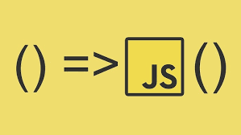

# Summary of this week
Phase 2: JavaScript Surgeons 🧑🏻‍⚕️

- This week includes 2 classes
- class_1 is about primitive , non-primitive and Heap & stack memory management
- class_2 is about Prototype and Polyfills

## Blog Challenges :

Blog about the arrow function: 

- Link - https://blog-himanshu.hashnode.dev/functions-building-blocks-of-javascript

Blog about Polyfills in javaScript

- Link - https://blog-himanshu.hashnode.dev/polyfills-bridging-gaps-in-javascript